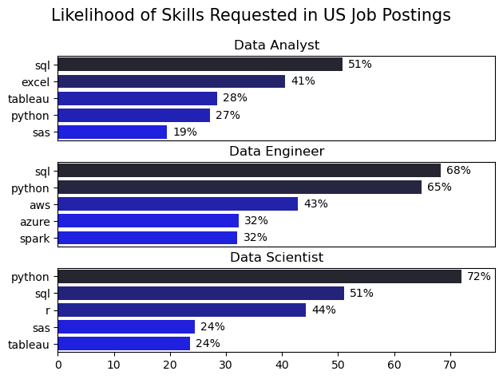
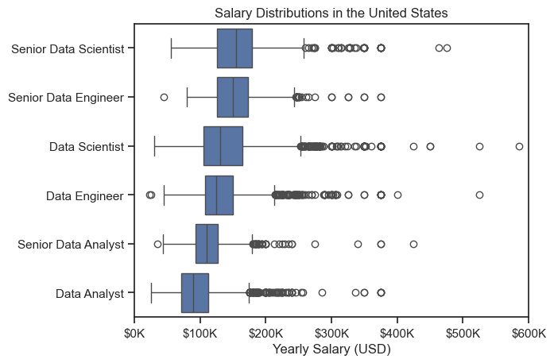
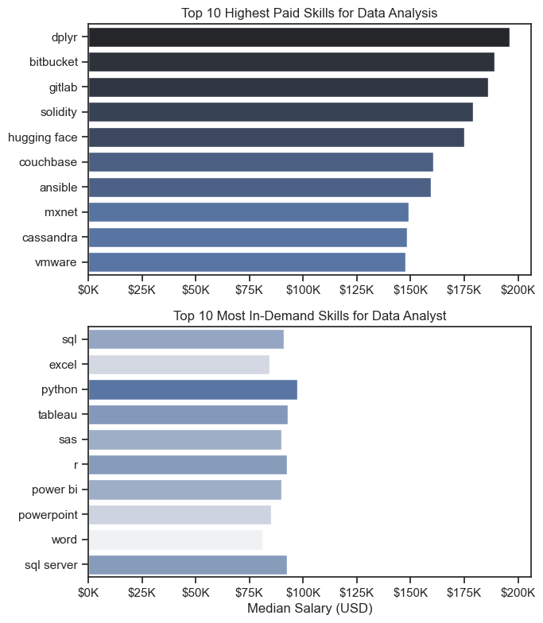
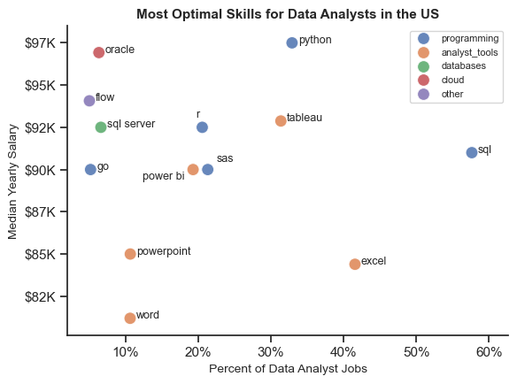

# Overview
Welcome to my analysis of the data job market, focusing on data analyst roles. This project was created out of a desire to navigate and understand the job market more effectively. It delves into the top-paying and in-demand skills to help find optimal job opportunities for data analysts.

The data sourced from [Luke Barousse's Python Course](https://lukeb.co/python_repo) which provides a foundation for my analysis, containing detailed information on job titles, salaries, locations, and essential skills. Through a series of Python scripts, I explore key questions such as the most demanded skills, salary trends, and the intersection of demand and salary in data analytics.

# The Questions
Below are the questions I want to answer in my project:

1. What are the skills most in demand for the top 3 most popular data roles?
2. How are in-demand skills trending for Data Analysts?
3. How well do jobs and skills pay for Data Analysts?
4. What are the optimal skills for data analysts to learn? (High Demand AND High Paying)

# Tools I Used
For my deep dive into the data analyst job market, I harnessed the power of several key tools:

* **Python:** The backbone of my analysis, allowing me to analyze the data and find critical insights. I also used the following Python libraries:
  * **Pandas Library:** This was used to analyze the data.
  * **Matplotlib Library:** I visualized the data.
  * **Seaborn Library:** Helped me create more advanced visuals.
* **Jupyter Notebooks:** The tool I used to run my Python scripts which let me easily include my notes and analysis.
* **Visual Studio Code:** My go-to for executing my Python scripts.
* **Git & GitHub:** Essential for version control and sharing my Python code and analysis, ensuring collaboration and project tracking.

# The Analysis

## 1. What are the most demanded skills for the top 3 most popular data roles?

To find the most demanded skills for the top 3 popular data roles, I filtered out those positions by their popularity, and retrieved the top 5 skills for each role. This query highlights the most popular job titles and their top skills, showing which skills should be prioritized depending on the role being targeted.

View my notebook with detailed steps here:
[2_Skill_Demand.ipynb](3.Project/2_Skills_Demand.ipynb)

### Visualize Data

```python

fig, ax = plt.subplots(len(job_titles), 1)

for i, job_title in enumerate(job_titles):
    df_plot = df_skills_perc[df_skills_perc['job_title_short'] == job_title].head(5)
    #df_plot.plot(kind='barh', x='job_skills', y='skill_percent', ax=ax[i], title=job_title)
    sns.barplot(data=df_plot, x='skill_percent', y='job_skills', ax=ax[i], hue='skill_count', palette='dark:b_r')

plt.show()
```
### Results


Line graph visualizing the most frequently requested skills for the top 3 popular data roles 
### Insights

- Python is a versatile skill, highly demanded across all three roles, but especially requested for Data Engineers (65%), and Data Scientists (72%)
- SQL is the highest demanded skill for Data Analysts roles(51%) and Data Engineers(68%). Python is the most sought after skill for Data Scientists, appearing in 72% of job postings.
- Data Engineers require mose specialized skills (AWS, Azure, Spark) compared to Data Abalysts and Data Scientists, who're expected to be more proficient in general data management and analysis tools (Excel, Tableau).

## 2. How are in-demand skills trending for Data Analyst?

### Visualize Data

```python
df_plot = df_DA_US_perc.iloc[:, :5]

sns.lineplot(data=df_plot, dashes=False, palette='tab10')
sns.set_theme(style='ticks')

from matplotlib.ticker import PercentFormatter
ax = plt.gca()
ax.yaxis.set_major_formatter(PercentFormatter(decimals=0))

plt.show()

```
### Results


Line graph visualizing the top trending skills for data analysts in the US in 2023

### Insights:
- SQL remains the most consistently demanded skill throuhgout the year, gradually decreasing in demand.

- Excel experienced a significant decrease in demand starting in August, and saw an increase in demand starting in November.

- Python and Tableau show relatively stable demand throughout the year while showing minor fluctuations by the end of the year.

- Power BI, while less demanded compared to the other skills, increased in demand slightly throughout the year.


## 3. How well do jobs and skills pay for Data Analysts?

### Salary Analysis for Data Nerds

#### Visualize Data
```python
sns.boxplot(data=df_US_top6, x='salary_year_avg', y='job_title_short', order=job_order)

ticks_x = plt.FuncFormatter(lambda y, pos: f"${int(y/1000)}K")
plt.gca().xaxis.set_major_formatter(ticks_x)
plt.show()
```
#### Results


Box plot visualizing the salary distribution for the top 6 data job titles.

### Insights:
- There's a significant variation in salary ranges across different job titles. Senior Data Scientist positions tend to have the highest salary potential, with up to $600K, indicating the high value placed on advanced data skills and experience in the industry.

- Senior Data Engineer and Senior Data Scientist roles show a considerable number of outliers on the higher end of the salary spectrum, suggesting that exceptional skills or circumstances can lead to high pay in these roles. In contrast, Data Analyst roles demonstrate more consistency in salary, with fewer outliers.

- The median salaries increase with the seniority and specialization of the roles. Senior roles (Senior Data Scientist, Senior Data Engineer) not only have higher median salaries but also larger differences in typical salaries, reflecting greater variance in compensation as responsibilities increase.

### Highest Paid & Most Demanded Skills for Data
#### Visualize Data

```python
fig, ax = plt.subplots(2, 1, figsize=(7, 8)) 

sns.barplot(data=df_DA_top_pay, x='median', y=df_DA_top_pay.index, ax=ax[0], hue='median', palette='dark:b_r')

sns.barplot(data=df_DA_skills, x='median', y=df_DA_skills.index, ax=ax[1], hue='median', palette='light:b')

plt.show()

```

#### Results
in-demand skills for data analysts in the US:



### Insights:
- The top graph highlights that specialized technical skills like dplyr, Bitbucket, and GitLab are associated with some of the highest salaries among data analyst tools. This indicates a significant valuation for data management and manipulation expertise in the industry.

- The bottom graph highlights that foundational skills like Python, Power Bi, and SQL are the most in-demand, even though they may not offer the highest salaries. This demonstrates the importance of these core skills for employability in data analysis roles.

- There's a clear distinction between the skills that are highest-paid and those that are most in-demand. Data analysts looking to maximize their career potential should consider developing a diverse skill set that includes both high-paying specialized skills and widely demanded foundational skills.

## 4. What is the most optimal skill to learn for Data Analysts?

### Visualize Data

```python
for i, text in enumerate(df_plot.index):
    plt.annotate(text, (df_plot['skill_perc'].iloc[i], df_plot['median_salary'].iloc[i]))

plt.show()

```

#### Results



### Insights:

- The scatter plot shows that most of the programming skills (colored blue) tend to cluster at higher salary levels compared to other categories, indicating that programming expertise might offer greater salary benefits within the data analytics field.

- Analyst tools (colored green), including Tableau and Power BI, are prevalent in job postings and offer competitive salaries, showing that visualization and data analysis software are crucial for current data roles. This category not only has good salaries but is also versatile across different types of data tasks.

- The database skills (colored orange), such as Oracle and SQL Server, are associated with some of the highest salaries among data analyst tools. This indicates a significant demand and valuation for data management and manipulation expertise in the industry.

# Conclusion

This exploration of the data analyst job market has been incredibly informative, highlighting the critical skills and trends that shape this evolving field. The insights I got enhance my understanding and provide actionable guidance for anyone looking to advance their career in data analytics. As the market continues to change, ongoing analysis will be essential to stay ahead in data analytics. This project is a good foundation for future explorations and underscores the importance of continuous learning and adaptation in the data field.